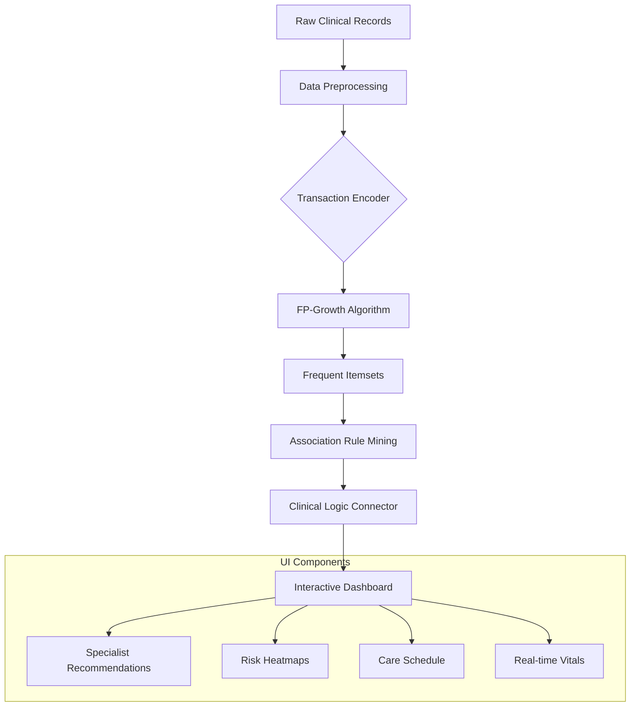

# ⚕️ Clinical Comorbidity & Treatment Patterns Dashboard

[](https://clinical-comorbidity-dashboard.streamlit.app/)
[](https://opensource.org/licenses/MIT)
[](https://www.python.org/downloads/)

An advanced, AI-driven clinical intelligence dashboard designed to discover and visualize complex comorbidity patterns and treatment associations in medical records using high-performance association rule mining (FP-Growth).

---

## 🚀 Live Demo
**Access the production dashboard here:** [https://clinical-comorbidity-dashboard.streamlit.app/](https://clinical-comorbidity-dashboard.streamlit.app/)

---

## 📊 Project Overview
This system processes large-scale clinical visit records to identify hidden relationships between primary diagnoses (e.g., Diabetes) and secondary conditions or treatments (e.g., Hypertension, Statins). It provides healthcare practitioners with actionable insights through a professional, high-fidelity user interface.

### Key Capabilities:
- **FP-Growth Mining Engine**: Rapidly discovers frequent itemsets and association rules with high lift and confidence.
- **Multi-Disciplinary Consult**: Context-aware specialist recommendations based on patient-specific comorbid clusters.
- **Live Vitals Simulation**: Real-time monitoring of patient health indicators (HR, Brain Activity, Temp).
- **Dynamic Care Pathway**: Visualizes the clinical journey and secondary risk progressions.

---

## 🛠 Technology Stack
- **Frontend**: Streamlit (Python-based Web Framework), Vanilla CSS (Glassmorphism), JavaScript (Interactive Modals).
- **Data Mining**: `mlxtend` (FP-Growth & Apriori algorithms).
- **Analytics**: `pandas`, `numpy`.
- **Visualization**: `networkx`, `matplotlib`, Custom SVG Generators.
- **Aesthetics**: Inter Font, HSL-based harmonious color palettes.

---

## 🧬 System Architecture & Pipeline



---

## 📖 How It Works

### 1. Data Processing
The system ingests raw visit data and transforms it into a transactional format where each visit is a set of clinical "items" (diagnoses, medications, age groups).

### 2. Association Mining
Using the **FP-Growth (Frequent Pattern Growth)** algorithm, the system builds a prefix tree (FP-tree) to compress the database and mine frequent patterns without expensive candidate generation.
- **Support**: Prevalence of the pattern in the population.
- **Confidence**: Reliability of the link between antecedent and consequent.
- **Lift**: Strength of the association compared to random chance.

### 3. Clinical Intelligence Layer
Discovered rules are passed through a **Specialist Mapping Layer** that translates raw technical outputs into clinical roles (e.g., "Diabetes + Hypertension" &rarr; "Refer to Cardiologist").

---

## 📸 Screenshots

### 👨‍⚕️ Multi-Disciplinary Consult Board
*High-fidelity specialist recommendations and clinical evidence.*


### ⛓ Comorbidity Network Graph
*Visualizing the complex web of medical associations.*


---

## ⚙️ Installation & Local Setup

1. **Clone the repository:**
   ```bash
   git clone https://github.com/Alan-911/clinical-comorbidity-dashboard.git
   cd clinical-comorbidity-dashboard
   ```

2. **Install dependencies:**
   ```bash
   pip install -r requirements.txt
   ```

3. **Run the dashboard:**
   ```bash
   streamlit run app.py
   ```

---

## 🛡 License
Distributed under the MIT License. See `LICENSE` for more information.

## 👥 Contact
**Project Lead**: [Alan-911](https://github.com/Alan-911)  
**Email**: [yvesalainiragena@gmail.com](mailto:yvesalainiragena@gmail.com)
